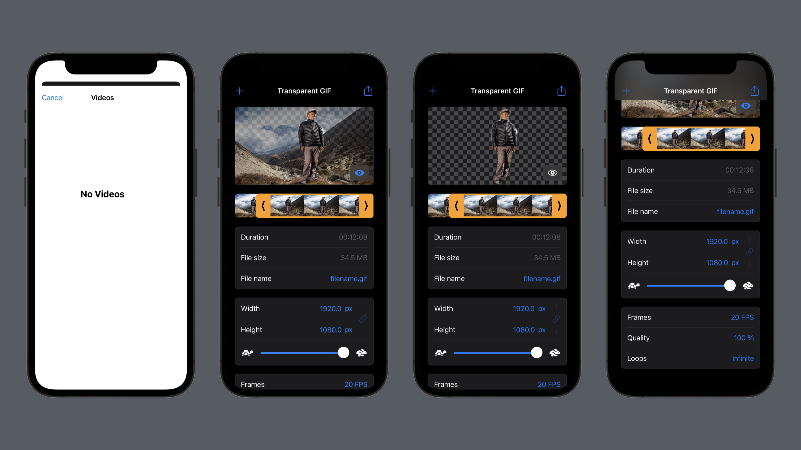
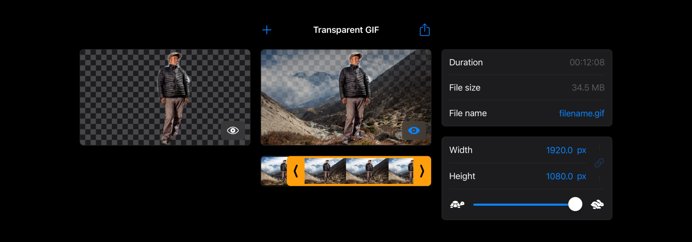

#   Transparent GIF

Automatically isolate the subject in a video, then export the result as a GIF.

 

 

**Architecture**

The application was built using a **Model-View-ViewModel** (MVVM) architecture, with one *data model* and one *design model*. The **data model** consists of the structures and logic necessary for driving the initialization, editing and encoding of the video. The **design model** defines the design system used throughout the application's views, and consists of standardised structures and properties.
 
 

**Design system**

The design of this application was standardized by leveraging view components, modifiers, extensions and a design model as an environment variable. The view components are reusable and multi-purpose, giving the application a consistent feel and appearance. The modifiers and extensions provide a set of standardized methods for styling the components. The design model provides sets of standardized variables for parameter values and colors.

 

 

**Status**

This project and its release candidate is the sum of a set of implemented features. This table enumerates the features, their implementation, and the status of their interface and functional implementation.

 

|Feature|Implementation|Interface|Functional|
|:-|:-|:-|:-|
|*Lorem ipsum*|*Lorem ipsum*|*Yes/No/None*|*Yes/No*|
|Load video|Video can be loaded from user videos through the library API, then copied to local application storage. Video is initialized in the data model by referencing its URL.|Yes|No|
|Image sequence|Extracts a sequence of images from the video to serial queue, then presents in view.|None|Yes|
|Remove background|Applies a subject isolation Machine Learning model to an image.|None|No|
|Export GIF|Encodes the image sequence to a GIF file, then saves it to user library or local device storage.|No|No|
|Trim video|Sets starting and ending point for the image sequence.|No|No|
|Estimate file size|Appropximate file size based on the pixel area density, frame count, and duration of the GIF.|Yes|No|
|Resize video|Sets the aspect ratio and crop of the video.|Yes|No|
|Slow-motion video|Increases the duration of each frame in the image sequence.|Yes|No|
|Speed-up video|Decreases the duration of each frame in the image sequence.|Yes|No|
|Video quality|Sets the quality value for the encoding.|Yes|No|
|Looping|Appends a reversed image sequence, resulting in a GIF that appears to loop.|Yes|No|